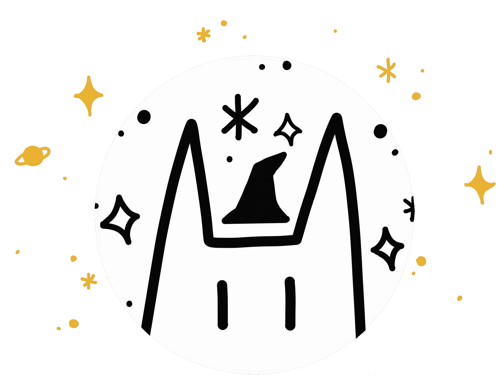

  
  

    
    
  

  
  <h1> Hey there 👋 I'm Celia  a Creative Developper</h1>
  <b>You can check my <a href="https://handsomely-moth-230.notion.site/C-lia-Leloup-c5ef46d679a546058fc5d5a76ba2284e">portfolio here ✨</a></b>

### 🔭 Some of my web projects
- 🏆 [Nyffin](https://gitlab.com/mli42/nyffin) - A website for an esport team ([nyffin.com](https://www.nyffin.com/))
- 🚀 [Pong Wars](https://github.com/celeloup/42_transcendence) - A fun web app to play pong in space 
- 🧠 [A psychology test web app](https://github.com/celeloup/psychology_test) - To help a friend learn how people's brains work

### 🌱 And some of my unusual projects
- ⭐ [Lumière d'Étoile](https://github.com/celeloup/lumiere_etoile) - A star map generator for the web 
- 🤡 [A cursed filter](https://github.com/celeloup/cursed_filter) - A weird camera filter made in JS 

### 💪 I am looking for work !
If you are looking for a *creative developper* that knows ReactJS and NodeJS, [**contact me**](https://www.linkedin.com/in/c%C3%A9lia-leloup-7b346a186/) !
